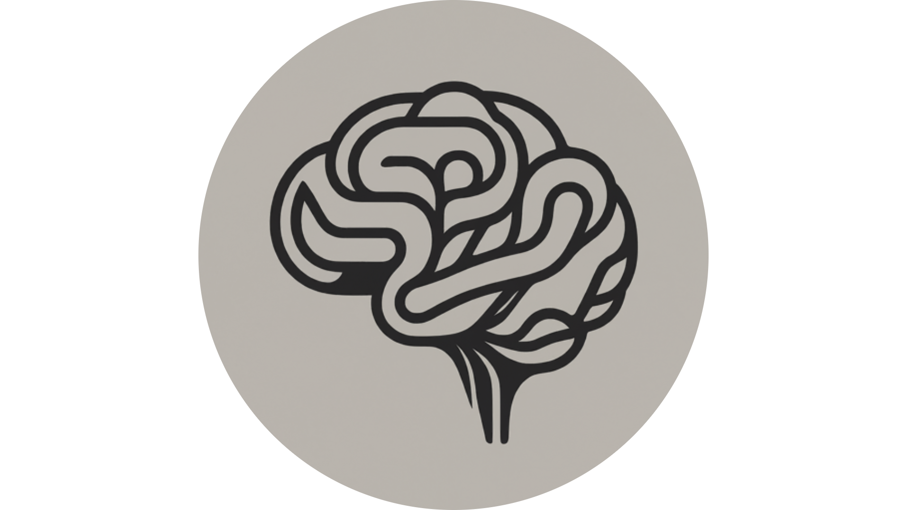

# Cognitive-Modeling-2024

> Team members: Kend'or Wilson, Matthew Merritt

## Repository Description:
A team repository for the COGS 4210 course at RPI.

### Why is why cognitive modeling is important for psychology and cognitive science?

Standing at the intersection of multiple soft and hard sciences, cognitive modeling provides both a tool for connecting, testing, and understanding countless fields. A clear strength of cognitive modeling is the ability to simulate complex cognitive processes and analyze behavior  that may not feasible to study through traditional methods such as observation. As [Cox, R. D. (1995). Model uncertainty, data mining and statistical inference.](https://www.jstor.org/stable/2983440) noted:
> "The construction of idealized representations that capture important stable aspects of such systems is, however, a vital part of general scientific analysis and statistical models, especially substantive ones, do not seem essentially different from other kinds of model."

Though our models are not perfect, they provide us insight, replicability, and abstractions that serve to advance our understands in both psychology and cognitive science.

